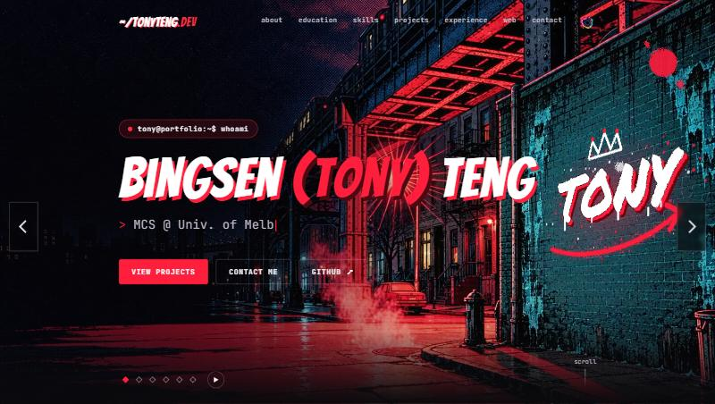

# tonyteng.dev

Personal website of **Bingsen (Tony) Teng** — Master of Computer Science
student at the University of Melbourne, working on cybersecurity, AI systems
and product engineering.

**Live:** https://tonyteng.dev



## What's inside

- **Multiverse hero** — six art styles take turns every 6 s with a glitch cut:
  Brooklyn comic print, an oil-paint drum solo, a punk paper collage, an anime
  rooftop, a Dunhuang mural and a 1930s rubber-hose cartoon. Each is a looping
  video with code-driven layers on top (pointer parallax, a graffiti tag that
  is sprayed live onto a wall in perspective, manga sound effects, a rotating
  mural wheel, cut-outs that rock on their own beat).
- **Glitch renderer** (`assets/spiderverse/rift.js`) — a canvas "dimensional
  rift" built from real pixels: fragments of the six worlds with split colour
  plates, datamosh smears and macroblocks around a breathing hexagonal portal
  with a video tunnel inside. Used by the nav icon, the intro, the 404 page
  and the universe cut; animated on twos (12 fps).
- **Holographic About card** — a layered 3D card with live foil, tilt (pointer
  or phone motion sensors) and the rift behind the portrait.
- **Terminal-flavoured UI** and an interactive 404 page
  (try https://tonyteng.dev/infected.exe).
- **Loading budget** — hero media is fetched one universe ahead, portrait
  phones get pre-cropped video slices, and Save-Data / slow connections get
  still frames.

## How it is built

`index.html` is a single-file bundle: the React app lives as a JSON-encoded
template inside it and is unpacked at load time. Changes to the template are
made with small, idempotent `patch-*.js` scripts rather than by hand. Larger
features live as plain files the template loads:

| Path | What |
| --- | --- |
| `assets/spiderverse/` | Multiverse hero (`spiderverse.jsx`, `.css`), rotation logic (`multiverse.js`), glitch renderer (`rift.js`), media |
| `assets/holo-card/` | Holographic About card |
| `404.html` | Glitch 404 page |
| `tests/` | `node:test` suites for the renderer, rotation logic, bundle integrity and the card's motion controller |

## Run it locally

```bash
npm install
npm run dev          # http://localhost:4000
node --test tests/*.cjs
```

Deploys to Cloudflare Workers on every push to `main` (`wrangler.jsonc`;
`.assetsignore` keeps dev files out of the upload).

## Credits

Visual assets were generated with AI image and video tools from the author's
own prompts and art direction, then edited and composited in code. Fonts:
Bangers (SIL OFL), Permanent Marker and Special Elite (Apache 2.0),
JetBrains Mono (SIL OFL).

## License

The source code is MIT-licensed. Photos, artwork, video, screenshots and the
site's written content are © Bingsen (Tony) Teng, all rights reserved — see
[LICENSE](LICENSE).
